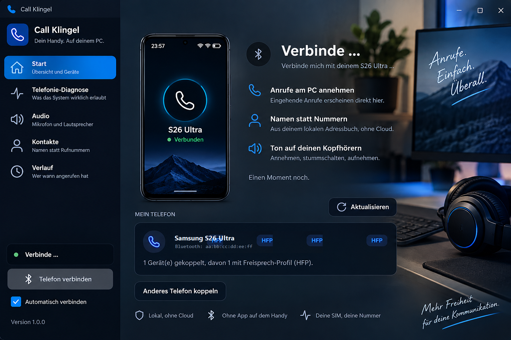

# Call Klingel

**Dein Handy. Auf deinem PC.**



*Gestaltungsentwurf. Die Anwendung sieht so aus, das Umfeld ist gestellt - und
"Ton auf deinen Kopfhörern" ist noch nicht umgesetzt, siehe Meilenstein 5.*

Eingehende Mobilfunkanrufe des Android-Smartphones am Windows- oder Linux-PC sehen,
annehmen, ablehnen, beenden und stummschalten. Der PC verhält sich dabei über Bluetooth
als Freisprecheinrichtung.

Keine Cloud-Telefonanlage. Keine zweite Rufnummer. Kein SIP-Anbieter. Keine Play-Store-App
als Voraussetzung. Das Smartphone bleibt das eigentliche Mobilfunktelefon.

---

## Aktueller Stand

Meilenstein 1 bis 4 sind abgeschlossen und auf echter Hardware nachgewiesen
(Samsung S26 Ultra, Gigabyte X670 AORUS ELITE AX).

| Nachgewiesen | Ergebnis |
|---|---|
| Telefon erkannt | Klasse `Phone`, HFP 0x111F, PBAP 0x112F |
| Service Level Connection | `+BRSF`, `+CIND`, `+CMER`, `+CHLD` |
| Eingehender Anruf am PC | `+CIEV: 2,1` -> Anruffenster |
| Annehmen vom PC aus | `ATA` -> `OK` -> `+CIEV: 1,1` |
| Kontakte über PBAP | 571 vCards gelesen |

Gemessen am 2026-09-10, 22:22 Uhr, mit einem echten Anruf und **unpackaged**.

### Wichtigstes Ergebnis

Die Windows-Telefonie-API ist für Drittanbieter tot - `RegisterApp()` bleibt wirkungslos
und meldet nie eine Telefonleitung, auch als MSIX mit `phoneCall`. Der Weg, der
funktioniert, ist ein anderer: Der PC spricht das **Hands-Free-Profil selbst** über einen
RFCOMM-Kanal zum Telefon. Das braucht kein MSIX-Paket und benutzt denselben Protokollcode,
den später auch Linux verwendet.

Messwerte und Herleitung in [docs/WINDOWS_TELEPHONY.md](docs/WINDOWS_TELEPHONY.md).

**Offen ist das Gesprächsaudio.** Der Ton läuft weiterhin über das Telefon, nicht über
die PC-Kopfhörer: Das Audio braucht einen SCO-Kanal, den nur der Windows-Bluetooth-Stack
öffnen kann - und der konkurriert mit unserer eigenen HFP-Verbindung um dieselbe
Profilverbindung. Siehe Meilenstein 5 in [docs/ROADMAP.md](docs/ROADMAP.md).

## Herunterladen

Alle Dateien liegen unter [Releases](../../releases/latest). Aktuelle Version: **0.4.0**

| System | Datei | Was damit geht |
|---|---|---|
| **Windows 10/11** | `CallKlingel-win-Setup.exe` | **Alles.** Anrufe sehen, annehmen, auflegen, Kontakte |
| **Linux** | `CallKlingel-linux.AppImage` | Nur die Oberfläche - siehe Hinweis unten |
| **macOS** | `CallKlingel-osx.dmg` | Nur die Oberfläche - siehe Hinweis unten |

Es wird kein .NET benötigt: In jedem Paket steckt alles Nötige.

### Windows

Setup herunterladen, doppelklicken, fertig. Die Installation läuft ohne Administratorrechte
in dein Benutzerprofil.

Beim ersten Start meldet sich der SmartScreen-Filter mit "Der Computer wurde durch Windows
geschützt", weil das Paket kein gekauftes Zertifikat trägt. Über **Weitere Informationen →
Trotzdem ausführen** geht es weiter. Wer das nicht möchte, nimmt die portable ZIP-Datei -
sie muss nirgends installiert werden.

Ab da hält sich die App selbst aktuell: Beim Start prüft sie still, ob eine neuere Version
vorliegt, und meldet sich nur dann. Heruntergeladen wird auf Klick, und **der Neustart ist
ein zweiter, eigener Klick** - eine App, die sich mitten im Gespräch beendet, wäre schlimmer
als eine, die einen Tag später aktualisiert.

### Linux und macOS - ehrlich gesagt

**Auf diesen Systemen kannst du derzeit nicht telefonieren.** Die Anwendung startet, die
Oberfläche funktioniert, Einstellungen und Kontakte lassen sich ansehen - aber jede
Anruffunktion meldet, dass sie nicht verfügbar ist.

| System | Stand |
|---|---|
| Linux | Backend ist ein Gerüst. Meilenstein 6 (BlueZ, PipeWire) ist nicht umgesetzt |
| macOS | Kein Backend vorhanden, auch keins geplant |

Das ist eine bewusste Entscheidung: Die Anwendung täuscht nichts vor. Lieber eine
Schaltfläche, die "nicht unterstützt" sagt, als eine, die so aussieht, als würde sie einen
Anruf annehmen.

Der Protokollteil liegt bereits plattformunabhängig in `Core/Hfp/`. Für Linux fehlt nur der
Transport - RFCOMM über BlueZ statt über WinRT. Bis dahin sind diese Pakete zum Ansehen da,
nicht zum Benutzen.

---

## Architektur

```
                  Avalonia Oberfläche
                          |
                  Telephony Interface
                          |
              +-----------+-----------+
              |                       |
     Windows Calls / HFP      BlueZ / PipeWire
              +-----------+-----------+
                          |
                      Bluetooth
                          |
                   Android-Smartphone
                          |
                    Mobilfunknetz
```

Die Oberfläche kennt ausschliesslich `ITelephonyService` und die abstrakten Zustände
`CallState` und `DeviceConnectionState` - niemals eine Windows- oder Linux-API.
Ausführlich in [docs/ARCHITECTURE.md](docs/ARCHITECTURE.md).

---

## Voraussetzungen

### Gemeinsam

- .NET SDK 9.0 oder neuer

### Windows

- Windows 10 Build 18362 oder neuer, empfohlen Windows 11
- Bluetooth-Adapter mit Classic-Unterstützung (BR/EDR). Reines Bluetooth LE reicht nicht.
- Windows SDK 10.0.26100 (für Build und Paketierung)
- Sideloading bzw. Entwicklermodus aktiviert
- Administratorrechte einmalig für die Installation des Testzertifikats
- **Kein** Microsoft-Store-Konto, **kein** gekauftes Zertifikat

### Linux

Das Linux-Backend ist noch nicht implementiert (Meilenstein 6). Geplant:

```
sudo apt install bluez pipewire pipewire-audio-client-libraries wireplumber libspa-0.2-bluetooth
```

---

## Bauen

```bash
git clone <repo>
cd CallKlingel
dotnet build CallKlingel.sln
dotnet test
```

## Installieren (Windows)

**Die App muss als MSIX installiert werden.** Das ist keine Bequemlichkeit, sondern
Voraussetzung: Nur ein Paket kann die Restricted Capability `phoneCall` deklarieren.
Ohne sie verweigert Windows den Telefoniezugriff mit `DeniedBySystem` - gemessen, siehe
[docs/WINDOWS_TELEPHONY.md](docs/WINDOWS_TELEPHONY.md).

Der Microsoft Store ist **nicht** nötig. Ein selbstsigniertes Zertifikat genügt.

In einer PowerShell **als Administrator**:

```powershell
powershell -ExecutionPolicy Bypass -File .\packaging\build-msix.ps1 -Install
```

Das Skript veröffentlicht die App, erzeugt das Paket, legt bei Bedarf ein
Testzertifikat an, signiert, importiert das Zertifikat nach `TrustedPeople` und
installiert das Paket.

Ohne `-Install` wird nur gebaut und signiert.

Starten:

```powershell
Start-Process "shell:appsFolder\CallKlingel_hjrfv1jsmn87m!App"
```

Oder über das Startmenü: **Call Klingel**.

### Voraussetzung: Sideloading

Windows muss Sideloading erlauben. Prüfen mit:

```powershell
Get-ItemProperty 'HKLM:\SOFTWARE\Microsoft\Windows\CurrentVersion\AppModelUnlock'
```

`AllowDevelopmentWithoutDevLicense = 1` oder der Entwicklermodus in den
Windows-Einstellungen genügt.

### Deinstallieren

```powershell
Get-AppxPackage -Name CallKlingel | Remove-AppxPackage
```

### Entwicklung ohne Paket

Für reine UI-Arbeit läuft die App auch unpackaged:

```bash
dotnet run --project src/CallKlingel.App
```

Dann sind Gerätesuche und Diagnose nutzbar, die Telefonie meldet aber
`DeniedBySystem`. Das ist erwartetes Verhalten, kein Fehler.

## Bluetooth-Kopplung

1. Am Smartphone Bluetooth einschalten und sichtbar machen.
2. Windows-Einstellungen -> Bluetooth und Geräte -> Gerät hinzufügen.
3. Nach dem Koppeln die **Geräteoptionen** öffnen und prüfen, dass das Profil
   **Telefonie / Freisprechen** aktiv ist. Nur Audio (A2DP) genügt nicht.
4. Am Smartphone die Anfrage zum Zugriff auf Anrufe bestätigen.

Ohne aktives Telefonieprofil meldet die Diagnose null HFP-Transportgeräte, und die
Anrufsteuerung kann nicht funktionieren.

---

## Diagnose

Die Diagnose ist das wichtigste Werkzeug dieses Projekts. Sie beantwortet die Frage, was
das Betriebssystem einer Drittanbieter-App wirklich erlaubt.

In der Anwendung: linke Navigation -> **Telefonie-Diagnose**.

Kopflos, ohne Oberfläche:

```bash
dotnet run --project tools/CallKlingel.Diagnostics.Cli
```

Jede Zeile nennt den tatsächlich ausgeführten API-Aufruf und im Fehlerfall den HRESULT,
damit sich das Ergebnis von Hand nachvollziehen lässt.

---

## Debugging

Debugausgaben aktivieren:

```bash
dotnet run --project src/CallKlingel.App -- --debug
```

Logdateien:

```
%LOCALAPPDATA%\CallKlingel\logs\callklingel-yyyy-MM-dd.log
```

Als MSIX leitet Windows das um nach:

```
%LOCALAPPDATA%\Packages\CallKlingel_hjrfv1jsmn87m\LocalCache\Local\CallKlingel\logs\n```

Rufnummern werden im Log grundsätzlich maskiert:

```
Incoming call from: +49 176 **** 5678
```

---

## Bekannte Einschränkungen

- **Gesprächsaudio läuft über das Telefon, nicht über den PC.** Die Anrufsteuerung am
  PC funktioniert, der Ton noch nicht. Meilenstein 5, und dort steht eine
  Architekturentscheidung an.
- **Rufnummer nicht immer sichtbar.** Beim ersten nachgewiesenen Anruf kamen weder `RING`
  noch `+CLIP`; die Oberfläche zeigte "Unbekannter Anrufer". Ursache ungeklärt.
- **Die Windows-Telefonie-API bleibt unbenutzbar.** `PhoneLineWatcher` meldet 0 Leitungen,
  auch als MSIX. Deshalb spricht die App HFP selbst - und braucht dafür kein Paket.
- **Linux-Backend fehlt.** Meilenstein 6. Alle Aktionen melden ehrlich "nicht unterstützt".
- **Keine Kontaktsynchronisierung.** PBAP ist später geplant und wird nie Voraussetzung
  sein. Ohne Kontakt wird die Rufnummer angezeigt.
- **Bluetooth Classic erforderlich.** HFP läuft nicht über Bluetooth LE.
- **Nur ein Anruf gleichzeitig.** Anklopfen und Konferenz sind nicht vorgesehen.

---

## Datenschutz

- Vollständig lokal. Keine Cloud erforderlich.
- Keine Gesprächsaufzeichnung.
- Keine Audioübertragung an eigene Server.
- Lokal gespeichert werden nur Einstellungen, bekannte Geräte und optional Kontakte und
  Anrufverlauf.
- Im geplanten Streamer-Modus erscheinen Rufnummer und Kontaktname standardmäßig **nie**
  in OBS.

---

## Entwicklungsregel

Nicht raten. Wenn eine API nicht funktioniert: Dokumentation prüfen, Betriebssystemversion
erkennen, Capabilities prüfen, Debugausgabe erstellen, Problem dokumentieren - und erst
danach eine Alternative implementieren.

Keine Schaltfläche darf so aussehen, als würde sie einen Mobilfunkanruf annehmen, wenn
sie das nicht nachweislich tut.
